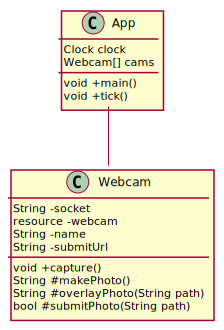

# Gumbo Millennium Plazacam

This is the script that manages the Gumbo Millennium Plazacam.

Since it needs to run headless on a Raspberry Pi, and I trust Java to run autonomously,
the application is written in Java.

## License

Licensed under [the MIT license](./LICENSE.md).

## Architecture

- A main method keeping track of the time and issuing a `makePhoto` call to the Webcam instances.
  - One or more `Webcam` instances, with three main objectives
    1. Making a photo on demand
    2. Processing that photo and adding some overlays
    3. Upload the photo via an HTTP request

Below is an example class diagram. A `resource` is the reference to the
webcam, initialised from the given socket. It's probably better to
acquire this resource beforehand, instead of on-demand.

## Installing

TODO
