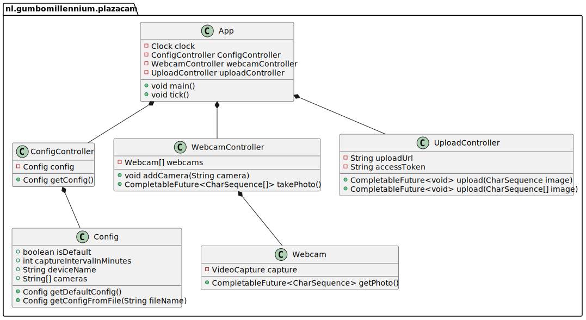

# Gumbo Millennium Plazacam

This is the script that manages the Gumbo Millennium Plazacam.

Since it needs to run headless on a Raspberry Pi, and I trust Java to run autonomously,
the application is written in Java.

## License

Licensed under [the MIT license](./LICENSE.md).

## Using the basic scripts

To install the basic scripts, run `curl -o- -L https://github.com/gumbo-millennium/plazacam/raw/main/scripts/update.sh | bash -`.  
This will install an updater an a capture script in your `~/bin` folder.

Then, create the required files:
 - `~/device-id.txt` containing a UUID to identify this file with
 - `~/device-access-token.txt` containing an [access token](https://gumbo.nu/mijn-account/api-tokens) to use to login with

Then, schedule it:

```cron
*/5 * * * ~/bin/capture-plazacam.sh
22  5 * * ~/bin/update-plazacam.sh
```

## Architecture

- The main `App` class
  - Keeps a single `ConfigController`, `CameraController` and `UploadController`
  - Asks the `CameraController` to create cameras based on the config
  - Asks the `CameraController` to make photos once every now and then
  - Uploads created photo using the `UploadController`
- The `ConfigController` class
  - Loads the config from a file, or writes a default config to a file if none exists
  - Translates configs to proper values
- The `CameraController` class
  - Keeps track of `CameraHandle` instances
  - Can be asked to create a number of cameras
  - Can be asked to produce a set of photos
- The `UploadController` class
  - Connects to a server and uploads JPEG files
- The `CameraHandle` class
  - Connects and controls a single connected camera
  - Can be asked to make a photo, returning a JPEG image

Below is an example class diagram. A `resource` is the reference to the
webcam, initialised from the given socket. It's probably better to
acquire this resource beforehand, instead of on-demand.



## Installing

TODO
